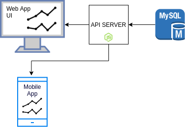

###################
Application details
###################

The application consists of a database server, a web application API
server and a static frontend. In this chapter we will discus in depth
the application details.

**************
About datasets
**************

We collected datasets from http://www.gapminder.org/. Our datasets
are related to murders, homicides and the political culture index of
a variety of countries for a series of years. Using those information
we can create useful charts that indicate how murders are affected by
the political culture index and how this values changed throught time.

*********************
Datasets manipulation
*********************

The raw downloaded datasets had to be manipulated before
loading them into our database. The transformation script
can be found on *scripts/transform_raw_to_fixed.py*.

The location of the raw datasets can be specified on the beginning
of the script.

After specifiying the location of the datasets you can run the script
using the following commands

.. code-block:: bash

    cd scripts
    python3 transform_raw_to_fixed.py

******************
Importing datasets
******************

After transforming the datasets according to the database schema
using the provided script, we have to load them into the database.
There's an *SQL* script that's responsible for loading them into the database
and is located at *scripts/bulk_load.sql*.

You have to specify the location of the clean datasets on the *bulk_load.sql*
script before executing it.

After specifying the datasets location you can run and import the datasets
using the following command

.. code-block:: bash

    cd scripts
    mysql -u <username> -p <password> <dbname> < bulk_load.sql

*Note: You have to replace username, password and dbname*

************************
Application architecture
************************

The web application consists of two separate components, the API that
is responsible for database communication and serving the data and
a static frontend that consumes the API and renders the results.

API
---
The API server is used for direct communication with the database. The API
is written in node.js.

Below you can see the available API endpoints.

.. code-block:: bash

    Fetch a list of the available API routes
    Route: /

    Fetch a list of the countries
    Route: /country

    Fetch a list of the continents
    Route: /continent

    Fetch homicides information
    Route: /homicides
    Params:
        age_from - The minimum age of the human in the results
        age_to - The maximum age of the human in the results
        gender - The gender of the human in the results ('F' or 'M')
        year_from - Results start from this year
        year_to - Results stop to this year
        country_ids - A list of the country IDs in the results
        years_group - An integer for grouping the years
                      e.g. 10 for average per decade for the specified countries

    Fetch political culture information
    Route: /culture
    Params:
        year_from - Results start from this year
        year_to - Results stop to this year
        country_ids - A list of the country IDs in the results

*Note: All the API endpoints accept GET method*

Frontend
--------
The Frontend is a SPA (Single page application), implemented with Vue.JS.
A static server inside the API server is used for serving the frontend
files that consume data from the API.
Frontend static files are html, css, javascript and media files.

The following diagram displays the data flow, throught the app.

*Note: The mobile app is an example and wasn't build during this project*
