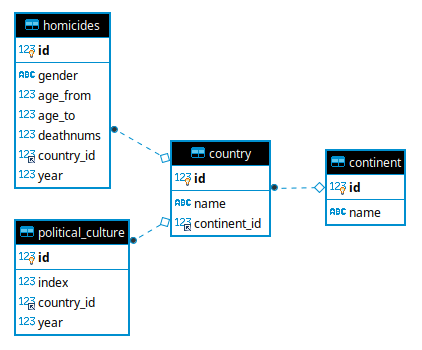

####################
Database information
####################

On this chapter we will discuss in depth the database details.
The DBMS of the application is a MySql server, specially configured
for the purpose of this web app.

*************
Configuration
*************

First we have to connect to MySql's CLI

.. code-block:: bash

    mysql -u root -p

Now we're going to create a new user that will be used to interact with
our API.

The user that we're creating has username *sysdba* and password
*12345678aA!* which we need to specify in conf.js.

.. code-block:: sql

    CREATE USER 'sysdba'@'%' IDENTIFIED BY '12345678aA!';
    GRANT ALL PRIVILEGES ON *.* TO 'sysdba'@'%' WITH GRANT OPTION;
    FLUSH PRIVILEGES;

*****************
Relational Schema
*****************

In the following picture we're presenting the database schema.

*******
Indexes
*******

Some database indexes had to be created on fields that are frequently
used by *WHERE* clauses. Indexing is really helpful for retreiving the
results faster. Below we're presenting the created indexes along with
the table they belong and the index type.

+--------------------+----------------+-------+
| Table              | Column         | Type  |
+====================+================+=======+
| country            | continent_id   | Btree |
+--------------------+----------------+-------+
| homicides          | country_id     | Btree |
+--------------------+----------------+-------+
| homicides          | age_from       | Btree |
+--------------------+----------------+-------+
| homicides          | age_to         | Btree |
+--------------------+----------------+-------+
| homicides          | gender         | Btree |
+--------------------+----------------+-------+
| homicides          | year           | Btree |
+--------------------+----------------+-------+
| political_culture  | country_id     | Btree |
+--------------------+----------------+-------+
| political_culture  | year           | Btree |
+--------------------+----------------+-------+

*NOTE: All the primary key fields are indexed by default*

***************
Users and roles
***************

Multiple users and roles are really helpful when a database is used by
multiple applications. For the purpose of this web app only one user
had to be created. This user is used by the API server to communicate
with the database.

***********
DBMS Tuning
***********

The following parameters were configured in order to achieve better
performance.

InnoDB buffer pool size
-----------------------
Since our database is really small in size, we can tune InnoDB to act
as an in-memory database by configuring the innodb_buffer_pool_size parameter.

This parameter can be edited on */etc/mysql/my.cnf* (for linux hosts) under
*[mysqld]* section. For our database we
can set *innodb_buffer_pool_size = 128M*.

*********
Changelog
*********

- (2019-04-20) Initial database schema
- (2019-04-24) Created indexes for frequently searched columns.
